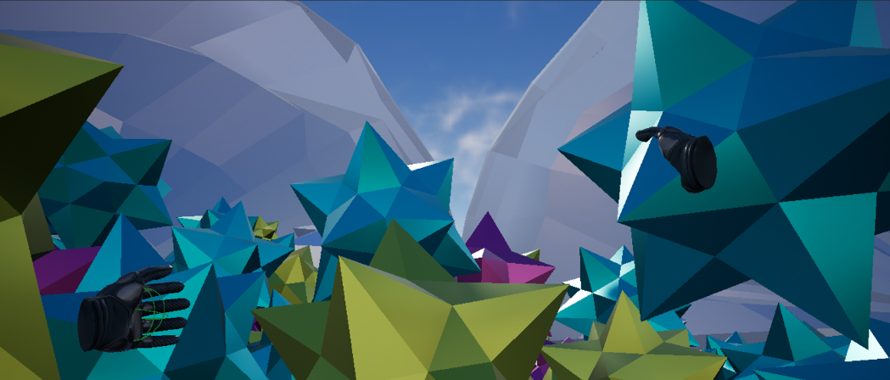

# About Myself
## Who Are You Anyway?

I'll just be cheeky and start with a classic bit of code we all first probably learned.

`print("Hello world!")`

Hello world!

You can just call me Kelsie. At the time of writing I am a graduating senior at UCSD majoring in Interdisciplinary Computing in the Arts and minoring in Computer Science and Engineering. In short, I've been learning the more creative side of coding for stuff like game development, virtual reality, etc. while minoring to learn and hone in on the technical side of coding (and other things that come with learning computer science apparently).

This page just has whatever I can think of putting as an introduction, so I'll leave these questions here for you to view as you want. Or scroll down as anyone normally would.

* [Why Are You in Programming?](#why-are-you-in-programming).
* [Have You Done Anything Fun or Cool?](#have-you-done-anything-fun-or-cool).
* [What Else Do You Like to Do?](#what-else-do-you-like-to-do).

## Why Are You in Programming?

In short...
> Because it actually challenges me.

And unlike other stuff that's felt frustrating or enigmatic, I keep finding myself wanting to understand how and why it works. My major works with the more creative aspects of coding like game development and virtual reality - all of which has been a nice introduction - and I decided to minor in computer science so I could learn and hone in on the technical aspects of coding (and other stuff that comes with computer science apparently).

## Have You Done Anything Fun Or Cool?

I'm currently working on a game demo for my senior project class. The game demo will be called *Killswitch* and be a rhythm-fighting game where you control a character throughout a boss fight and fight in sync to the beat of the backing soundtrack. At this time, the game itself is still in its early stages of actual development, but you can check out some info about its concept [here](https://docs.google.com/document/d/14k8jhXwxxiHjgZUgF6Y7mPiSnR9g2SDsqMfttyQsd-s/edit?usp=sharing), [here](https://docs.google.com/presentation/d/1cUBGJgeRHwT7EjNuaZUIpleSGSjECWKnAgB0DXDKnxU/edit?usp=sharing) and [here](https://docs.google.com/presentation/d/1sHi5L9jnNL1yr6pu1nzAEI0zlmMl8yK5Y3B_1g-F9BY/edit?usp=sharing).

Basically, progress thus far can be summed up like this:
- [x] Think up the concept (I want to make a rhythm game demo)
- [x] Look into ways this concept can be programmed (Rather what kinda references can we start with)
- [x] Flesh out the concept (Figured out what I want it to look like, sound like, play like!)
- [ ] Now start building the game!! (By bits and pieces of course)

This demo is meant to be a love letter to my love for electronic music and provide a more immersive experience to listening to this sort of music - 'gamifying' music, if you will. It's currently a long ways to go and may be a bit ambititious for this quarter - there's always some guarentee some things will have to be modified for the sake of delivering for my final senior project. Regardless, I'm very excited to work on it and see where it goes. I've built a couple games in Unity prior, so this will be my greatest in scale thus far.

If you're curious about other stuff I've done in other classes, I've done a couple VR environments in Unreal Engine, including one called *CMY* which was a ball pit called filled with colorful metallic spike balls you can play in and climb around as a weird crystalline jungle gym using the Oculus headset.

I've also done a few p5.js projects in Javascript, one of my favorite examples - an audiovisual animation to a metal track - of which you can view [here](https://editor.p5js.org/kalloyd/sketches/o2Ipy5dX0).

I'm really hoping to take a class in Arduino either this coming quarter or my last part-time quarter. Should I update this about page further, I'll be happy to talk about any projects I make once I take it!

## What Else Do You Like to Do?

As you can guess, I love music a lot. I don't play it, but I love listening to it. My favorite genres are metal, goth rock, and electronic. If you're also familiar with metal, my favorite subgenres are thrash, death, industrial and doom. Some of my favorite bands are Megadeth, Motorhead, Overkill, Rammstein, Death, Exodus, Ministry, Scythelord, Judas Priest and Slayer, and I've recently been getting into Candlemass, Municipal Waste and Electric Wizard. For non-metal bands, my first love was (and still very much is) Bauhaus and I also love Sisters of Mercy, Oingo Boingo, The Birthday Party, Siouxsie and the Banshees, Depeche Mode, The Damned among others. You can find me also listening to Pendulum, deadmau5, Carpenter Brut, Lady Gaga, Mystery Skulls, Justice, and Perturbator a lot.

Like I said, I don't play music but I love singing karaoke! Which, fun fact, I actually have been practicing and now can actually sing in death metal growls. Properly and without hurting my vocal chords too!

My other favorite hobby is drawing

I love videos games a lot too. They're a third lifelong love of mine besides drawing and music. I have a lot of favorites but in no particular order, five of my top ones are:

1. Hotline Miami
2. Team Fortess 2
3. Cuphead
4. Sonic Adventure 2
5. Minecraft

I also love watching anime and movies with my friends and boyfriend. Some of my favorite anime are *Mob Psycho 100*, *Jojo's Bizarre Adventure* (*Stardust Crusaders* and *Stone Ocean* are my favorite parts) and *Kill la Kill*. Alongside a few games on my list above I sometimes like to draw Jojo and Mob Psycho stuff too for fun. Some of my favorite movies are *Army of Darkness*, the *John Wick* series, *Beetlejuice* and *The Nightmare Before Christmas*.

I'm not sure how else to end this section, but since I mentioned Sonic Adventure 2...fun fact, [this is not the first time I had to make a markdown page as a school assignment on Github](goofy.md).
